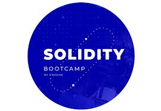
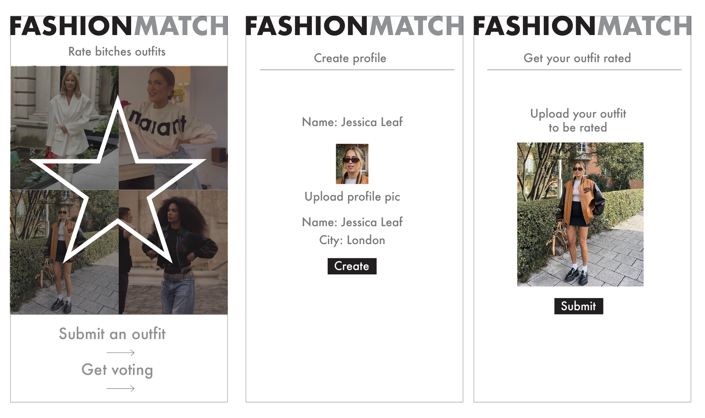
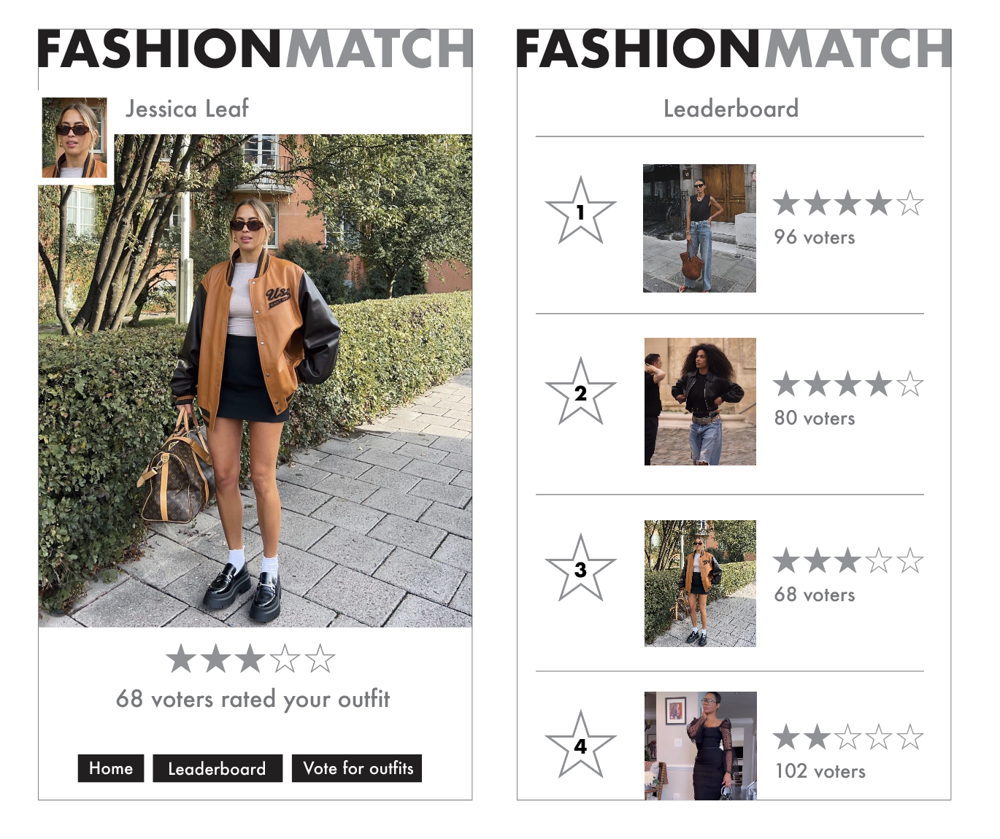

# EncodeClubSolidityFinalProject

## **final Solidity project summary**

The "final project" for the Solidity bootcamp with a 3 mins demo/presentation.



## Encode Club Solidity bootcamp

https://www.encode.club/solidity-bootcamps

https://github.com/orgs/Encode-Club-Solidity-Bootcamp/repositories

<br>
<br>

<br>
<br>

**FashionMatch** is a decenteralised application designed to engage users in the fashion space to share and interact.
Users can submit photos of their fashion looks, which are then displayed for the community to view and vote on.
The application uses smart contracts to ensure transparent and secure voting, where each votes contributes to the overall
fashion entries.

The platform uses an easy to use inteface, allowing easy submission of looks, voting and real-time display of
the top-voted entries. By using blockchaing technology, **FashionMatch** offers a fair and interactive way for fashion
divas, to showcase their style and gain recognition and be see within the community as the bad bitch they are.

<br>
<br>

## **fashionmatch `log-in`**

<br>


<br>
<br>

## **fashionmatch `wireframes`**

<br>


<br>
<br>

### **figma `animation`:**

<br>

User walkthorough and interface for fashionmatch

[link](https://www.figma.com/design/ECGuCCqogKf0cOHW5pxZhx/FashionMatch?node-id=0-1&t=5QjLDEMYXSOCHo5E-0)

<br>

### **fashionmatch `setup`:**

<br>

```
git clone https://github.com/paulinejdavis/EncodeClubSolidityFinalProject.git
npm install
nvm use 18.17.0
npx hardhat compile
npm run dev

npm run build
npm start
```

### **`tech` stack**

<br>

&nbsp;&nbsp;&nbsp;


<br>

### **next `steps`**

<br>

- continue building up the front-end
- complete the authorisation, authentication and profiles of user signup/login
- allow users to submit, signup and login
- store submitted photos using IPFS(Interplanetary File System)
- add comments and feedback functionality
- create a leaderboard
- advanced serach and filtering functionality
- ensure mobile responsiveness and dark/light mode
- integrate with social media
- analytics and insights
